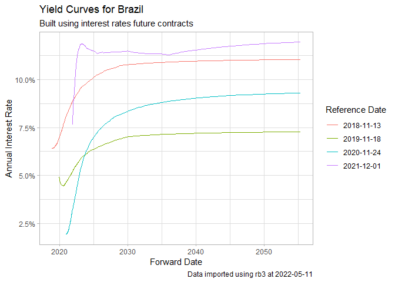

<!-- README.md is generated from README.Rmd. Please edit that file -->

# rb3 

<!-- badges: start -->

[](https://www.repostatus.org/#active)
[](https://app.codecov.io/gh/wilsonfreitas/rb3?branch=main)
[](https://github.com/ropensci/rb3/actions)
[](https://CRAN.R-project.org/package=rb3)
[](https://cran.r-project.org/package=rb3)
[](https://github.com/ropensci/software-review/issues/534)
<!-- badges: end -->

[B3](https://www.b3.com.br) is the main financial exchange in Brazil,
offering support and access to trading systems for equity and fixed
income markets. In its website you can find a vast number of datasets
regarding prices and transactions for contracts available for trading at
these markets, including:

-   equities/stocks
-   futures
-   FII (Reits)
-   options
-   BDRs
-   historical yield curves (calculated from futures contracts)
-   B3 indexes composition

For example, you can find the current yield curve at this
[link](https://www.b3.com.br/pt_br/market-data-e-indices/servicos-de-dados/market-data/consultas/mercado-de-derivativos/precos-referenciais/taxas-referenciais-bm-fbovespa/).
Package **rb3** uses webscraping tools to download and read these
datasets from [B3](https://www.b3.com.br), making it easy to consume it
in R in a structured way.

The available datasets are highly valuable, going back as early as
2000’s, and can be used by industry practitioners or academics. None of
these datasets are available anywhere else, which makes rb3 an unique
package for data importation from the Brazilian financial exchange.

# Documentation

The documentation is available in its [pkgdown
page](https://ropensci.github.io/rb3/), where articles (vignettes) with
real applications can be found.

## Installation

Package rb3 is available in its stable form in CRAN and its development
version in Github. Please find the installation commands below:

``` r
# stable (CRAN)
install.packages("rb3")

# github (Development branch)
if (!require(devtools)) install.packages("devtools")
devtools::install_github("ropensci/rb3")
```

## Examples

### Yield curve

In this first example we’ll import and plot the historical yield curve
for Brazil using function `yc_get`.

``` r
library(rb3)
library(ggplot2)
library(stringr)

df_yc <- yc_mget(
  first_date = Sys.Date() - 255 * 5,
  last_date = Sys.Date(),
  by = 255
)
#> Warning: Automatic coercion from double to character was deprecated in purrr 1.0.0.
#> ℹ Please use an explicit call to `as.character()` within `map_chr()` instead.
#> ℹ The deprecated feature was likely used in the rb3 package.
#>   Please report the issue at <https://github.com/wilsonfreitas/rb3/issues>.

p <- ggplot(
  df_yc,
  aes(
    x = forward_date,
    y = r_252,
    group = refdate,
    color = factor(refdate)
  )
) +
  geom_line() +
  labs(
    title = "Yield Curves for Brazil",
    subtitle = "Built using interest rates future contracts",
    caption = str_glue("Data imported using rb3 at {Sys.Date()}"),
    x = "Forward Date",
    y = "Annual Interest Rate",
    color = "Reference Date"
  ) +
  theme_light() +
  scale_y_continuous(labels = scales::percent)

print(p)
```



### Futures prices

Get settlement future prices with `futures_get`.

``` r
library(rb3)
library(dplyr)

df <- futures_mget(
  first_date = "2022-04-01",
  last_date = "2022-04-29",
  by = 5
)

glimpse(
  df |>
    filter(commodity == "DI1")
)
#> Rows: 153
#> Columns: 8
#> $ refdate          <date> 2022-04-01, 2022-04-01, 2022-04-01, 2022-04-01, 2022…
#> $ commodity        <chr> "DI1", "DI1", "DI1", "DI1", "DI1", "DI1", "DI1", "DI1…
#> $ maturity_code    <chr> "J22", "K22", "M22", "N22", "Q22", "U22", "V22", "X22…
#> $ symbol           <chr> "DI1J22", "DI1K22", "DI1M22", "DI1N22", "DI1Q22", "DI…
#> $ price_previous   <dbl> 99999.99, 99172.50, 98159.27, 97181.87, 96199.14, 951…
#> $ price            <dbl> 100000.00, 99172.31, 98160.23, 97185.43, 96210.42, 95…
#> $ change           <dbl> 0.01, -0.19, 0.96, 3.56, 11.28, 21.61, 34.93, 48.85, …
#> $ settlement_value <dbl> 0.01, 0.19, 0.96, 3.56, 11.28, 21.61, 34.93, 48.85, 5…
```

### Equity data

Equity closing data (without **ANY** price adjustments) is available
thru `cotahist_get`.

``` r
library(rb3)
library(bizdays)
#> 
#> Attaching package: 'bizdays'
#> The following object is masked from 'package:stats':
#> 
#>     offset

# fix for ssl error (only in linux)
if (Sys.info()["sysname"] == "Linux") {
  httr::set_config(
    httr::config(ssl_verifypeer = FALSE)
  )
}

date <- preceding(Sys.Date() - 1, "Brazil/ANBIMA") # last business day
ch <- cotahist_get(date, "daily")

glimpse(
  cotahist_equity_get(ch)
)
#> Rows: 367
#> Columns: 13
#> $ refdate               <date> 2023-03-03, 2023-03-03, 2023-03-03, 2023-03-03,…
#> $ symbol                <chr> "AERI3", "AESB3", "AFLT3", "AGRO3", "AGXY3", "BR…
#> $ open                  <dbl> 1.15, 10.00, 8.89, 26.15, 8.45, 25.89, 28.83, 14…
#> $ high                  <dbl> 1.17, 10.18, 8.89, 26.60, 9.06, 26.35, 29.24, 15…
#> $ low                   <dbl> 1.11, 9.96, 8.71, 26.12, 8.39, 25.80, 28.76, 14.…
#> $ close                 <dbl> 1.12, 10.16, 8.71, 26.33, 9.06, 25.92, 28.92, 14…
#> $ average               <dbl> 1.14, 10.08, 8.80, 26.39, 8.75, 26.13, 29.00, 14…
#> $ best_bid              <dbl> 1.12, 10.14, 8.71, 26.32, 8.92, 25.92, 28.81, 14…
#> $ best_ask              <dbl> 1.13, 10.16, 8.99, 26.33, 9.06, 26.08, 28.92, 14…
#> $ volume                <dbl> 4481724, 19128087, 1760, 7341008, 234691, 689933…
#> $ traded_contracts      <dbl> 3926400, 1897500, 200, 278100, 26800, 26400, 305…
#> $ transactions_quantity <int> 2818, 5573, 2, 1399, 177, 140, 7403, 17092, 1464…
#> $ distribution_id       <int> 101, 105, 119, 113, 101, 145, 145, 123, 102, 166…
```

### Funds data

One can also download hedge fund data with `cotahist_etfs_get`.

``` r
glimpse(
  cotahist_etfs_get(ch)
)
#> Rows: 100
#> Columns: 13
#> $ refdate               <date> 2023-03-03, 2023-03-03, 2023-03-03, 2023-03-03,…
#> $ symbol                <chr> "AGRI11", "IBOB11", "OGIN11", "BOVB11", "BOVS11"…
#> $ open                  <dbl> 43.51, 84.31, 9.51, 104.52, 79.95, 104.50, 10.40…
#> $ high                  <dbl> 43.63, 84.31, 9.63, 105.11, 80.57, 105.74, 10.51…
#> $ low                   <dbl> 42.91, 84.17, 9.35, 104.52, 79.74, 104.49, 10.40…
#> $ close                 <dbl> 43.10, 84.17, 9.57, 104.68, 80.13, 104.90, 10.45…
#> $ average               <dbl> 43.40, 84.17, 9.50, 104.68, 80.22, 105.17, 10.46…
#> $ best_bid              <dbl> 41.50, 83.51, 9.44, 104.68, 80.13, 104.90, 10.45…
#> $ best_ask              <dbl> 46.24, 84.18, 9.57, 113.00, 90.00, 105.11, 10.49…
#> $ volume                <dbl> 2274762.37, 1375010.67, 14024.14, 241499.09, 444…
#> $ traded_contracts      <dbl> 52405, 16336, 1476, 2307, 554, 1733901, 336092, …
#> $ transactions_quantity <int> 50, 6, 24, 15, 452, 11558, 1949, 5, 25, 4402, 4,…
#> $ distribution_id       <int> 100, 100, 102, 100, 100, 101, 100, 101, 100, 100…
```

### FIIs (Brazilian REITs) data

Download FII (Fundo de Investimento Imobiliário) data with
`cotahist_fiis_get`:

``` r
glimpse(
  cotahist_fiis_get(ch)
)
#> Rows: 268
#> Columns: 13
#> $ refdate               <date> 2023-03-03, 2023-03-03, 2023-03-03, 2023-03-03,…
#> $ symbol                <chr> "BZLI11", "AFHI11", "IBCR11", "IDGR11", "LUGG11"…
#> $ open                  <dbl> 17.00, 94.69, 76.73, 80.50, 71.98, 94.83, 11.50,…
#> $ high                  <dbl> 17.00, 94.70, 77.00, 80.50, 72.00, 95.88, 11.50,…
#> $ low                   <dbl> 17.00, 93.72, 76.39, 80.50, 71.16, 94.02, 11.49,…
#> $ close                 <dbl> 17.00, 94.20, 77.00, 80.50, 71.61, 94.31, 11.49,…
#> $ average               <dbl> 17.00, 94.19, 76.70, 80.50, 71.53, 94.59, 11.49,…
#> $ best_bid              <dbl> 17.00, 94.20, 76.74, 1.00, 71.42, 94.31, 10.96, …
#> $ best_ask              <dbl> 18.00, 94.42, 77.00, 80.50, 71.61, 94.32, 11.49,…
#> $ volume                <dbl> 357.00, 453376.17, 54150.68, 8050.00, 46068.54, …
#> $ traded_contracts      <dbl> 21, 4813, 706, 100, 644, 11197, 10, 70, 207, 100…
#> $ transactions_quantity <int> 2, 1670, 75, 1, 203, 3116, 4, 6, 58, 73, 2650, 2…
#> $ distribution_id       <int> 100, 124, 121, 112, 140, 152, 213, 102, 226, 144…
```

### BDRs data

Download BDR (Brazilian depositary receipts) with `cotahist_bdrs_get`:

``` r
glimpse(
  cotahist_bdrs_get(ch)
)
#> Rows: 507
#> Columns: 13
#> $ refdate               <date> 2023-03-03, 2023-03-03, 2023-03-03, 2023-03-03,…
#> $ symbol                <chr> "ADBE34", "CSCO34", "I1QV34", "I1QY34", "I1RM34"…
#> $ open                  <dbl> 34.60, 50.53, 283.92, 19.76, 283.50, 500.19, 60.…
#> $ high                  <dbl> 35.86, 51.44, 287.00, 20.00, 283.50, 500.19, 61.…
#> $ low                   <dbl> 34.60, 50.53, 283.92, 19.70, 283.50, 500.19, 60.…
#> $ close                 <dbl> 35.48, 51.44, 287.00, 19.96, 283.50, 500.19, 61.…
#> $ average               <dbl> 35.40, 51.18, 285.46, 19.75, 283.50, 500.19, 60.…
#> $ best_bid              <dbl> 35.48, 48.45, 0.00, 19.55, 249.50, 200.00, 59.40…
#> $ best_ask              <dbl> 39.98, 51.44, 335.10, 0.00, 310.00, 0.00, 70.00,…
#> $ volume                <dbl> 600948.59, 437857.01, 570.92, 39665.04, 1134.00,…
#> $ traded_contracts      <dbl> 16972, 8555, 2, 2008, 4, 472, 77, 500, 535693, 1…
#> $ transactions_quantity <int> 230, 144, 2, 25, 1, 2, 2, 2, 1041, 13, 54, 92, 2…
#> $ distribution_id       <int> 101, 149, 100, 100, 112, 113, 102, 146, 117, 112…
```

### Equity options

Download equity options contracts with `cotahist_option_get`:

``` r
glimpse(
  cotahist_equity_options_get(ch)
)
#> Rows: 6,656
#> Columns: 14
#> $ refdate               <date> 2023-03-03, 2023-03-03, 2023-03-03, 2023-03-03,…
#> $ symbol                <chr> "ABCBC200", "ABCBO176", "ABEVF160", "ABEVP300", …
#> $ type                  <fct> Call, Put, Call, Put, Put, Put, Put, Put, Call, …
#> $ strike                <dbl> 19.69, 17.69, 14.82, 18.82, 28.82, 14.82, 13.82,…
#> $ maturity_date         <date> 2023-03-17, 2023-03-17, 2023-06-16, 2023-04-20,…
#> $ open                  <dbl> 0.07, 0.28, 0.30, 5.48, 15.30, 1.50, 0.90, 2.76,…
#> $ high                  <dbl> 0.07, 0.28, 0.30, 5.48, 15.30, 1.50, 0.98, 2.76,…
#> $ low                   <dbl> 0.06, 0.28, 0.28, 5.48, 15.28, 1.50, 0.90, 2.76,…
#> $ close                 <dbl> 0.06, 0.28, 0.28, 5.48, 15.28, 1.50, 0.98, 2.76,…
#> $ average               <dbl> 0.06, 0.28, 0.28, 5.48, 15.28, 1.50, 0.92, 2.76,…
#> $ volume                <dbl> 76, 140, 86, 5480, 7643, 1500, 7530, 1380, 10423…
#> $ traded_contracts      <dbl> 1100, 500, 300, 1000, 500, 1000, 8100, 500, 3898…
#> $ transactions_quantity <int> 2, 1, 3, 2, 4, 1, 3, 1, 89, 2, 13, 8, 2, 174, 12…
#> $ distribution_id       <int> 142, 143, 124, 124, 124, 124, 124, 124, 125, 125…
```

### Indexes composition

The list with available B3 indexes can be obtained with `indexes_get`.

``` r
indexes_get()
#>  [1] "AGFS" "BDRX" "GPTW" "IBOV" "IBRA" "IBXL" "IBXX" "ICO2" "ICON" "IDIV"
#> [11] "IEEX" "IFIL" "IFIX" "IFNC" "IGCT" "IGCX" "IGNM" "IMAT" "IMOB" "INDX"
#> [21] "ISEE" "ITAG" "IVBX" "MLCX" "SMLL" "UTIL"
```

And the composition of a specific index with `index_comp_get`.

``` r
(ibov_comp <- index_comp_get("IBOV"))
#>  [1] "ABEV3"  "ALPA4"  "AMER3"  "ASAI3"  "AZUL4"  "B3SA3"  "BBAS3"  "BBDC3" 
#>  [9] "BBDC4"  "BBSE3"  "BEEF3"  "BIDI11" "BPAC11" "BPAN4"  "BRAP4"  "BRFS3" 
#> [17] "BRKM5"  "BRML3"  "CASH3"  "CCRO3"  "CIEL3"  "CMIG4"  "CMIN3"  "COGN3" 
#> [25] "CPFE3"  "CPLE6"  "CRFB3"  "CSAN3"  "CSNA3"  "CVCB3"  "CYRE3"  "DXCO3" 
#> [33] "ECOR3"  "EGIE3"  "ELET3"  "ELET6"  "EMBR3"  "ENBR3"  "ENEV3"  "ENGI11"
#> [41] "EQTL3"  "EZTC3"  "FLRY3"  "GGBR4"  "GOAU4"  "GOLL4"  "HAPV3"  "HYPE3" 
#> [49] "IGTI11" "IRBR3"  "ITSA4"  "ITUB4"  "JBSS3"  "JHSF3"  "KLBN11" "LCAM3" 
#> [57] "LREN3"  "LWSA3"  "MGLU3"  "MRFG3"  "MRVE3"  "MULT3"  "NTCO3"  "PCAR3" 
#> [65] "PETR3"  "PETR4"  "PETZ3"  "POSI3"  "PRIO3"  "QUAL3"  "RADL3"  "RAIL3" 
#> [73] "RDOR3"  "RENT3"  "RRRP3"  "SANB11" "SBSP3"  "SLCE3"  "SOMA3"  "SULA11"
#> [81] "SUZB3"  "TAEE11" "TIMS3"  "TOTS3"  "UGPA3"  "USIM5"  "VALE3"  "VBBR3" 
#> [89] "VIIA3"  "VIVT3"  "WEGE3"  "YDUQ3"
```

With the index composition you can use COTAHIST to select their quotes.

``` r
glimpse(
  cotahist_get_symbols(ch, ibov_comp)
)
#> Rows: 88
#> Columns: 13
#> $ refdate               <date> 2023-03-03, 2023-03-03, 2023-03-03, 2023-03-03,…
#> $ symbol                <chr> "BRAP4", "CSAN3", "CSNA3", "LREN3", "LWSA3", "PC…
#> $ open                  <dbl> 28.83, 14.73, 17.90, 18.27, 4.58, 14.36, 13.12, …
#> $ high                  <dbl> 29.24, 15.06, 18.52, 18.27, 4.81, 14.70, 13.22, …
#> $ low                   <dbl> 28.76, 14.64, 17.85, 17.74, 4.58, 14.19, 12.99, …
#> $ close                 <dbl> 28.92, 14.74, 18.24, 17.75, 4.75, 14.41, 13.11, …
#> $ average               <dbl> 29.00, 14.85, 18.29, 17.93, 4.70, 14.47, 13.09, …
#> $ best_bid              <dbl> 28.81, 14.73, 18.24, 17.74, 4.74, 14.41, 13.11, …
#> $ best_ask              <dbl> 28.92, 14.74, 18.25, 17.76, 4.75, 14.45, 13.12, …
#> $ volume                <dbl> 88684490, 108449481, 151985388, 179220052, 42526…
#> $ traded_contracts      <dbl> 3057800, 7302400, 8307600, 9995000, 9041300, 263…
#> $ transactions_quantity <int> 7403, 17092, 13794, 28476, 12587, 7990, 34400, 2…
#> $ distribution_id       <int> 145, 123, 258, 215, 102, 166, 126, 115, 134, 144…
```

## Template System

One important part of `rb3` infrastructure is its `Template System`.

All datasets handled by the rb3 package are configured in a template,
that is an YAML file. The template brings many information regarding the
datasets, like its description and its metadata that describes its
columns, their types and how it has to be parsed. The template fully
describes its dataset.

Once you have the template implemented you can fetch and read downloaded
data directly with the functions `download_marketdata` and
`read_marketdata`.

For examples, let’s use the template `FPR` to download and read data
regarding primitive risk factor used by B3 in its risk engine.

``` r
f <- download_marketdata("FPR", refdate = as.Date("2022-05-10"))
f
#> [1] "C:/Users/wilso/R/rb3-cache/FPR/7a2422cc97221426a3b2bd4419215481/FP220510/FatoresPrimitivosRisco.txt"
```

`download_marketdata` returns the path for the downloaded file.

``` r
fpr <- read_marketdata(f, "FPR")
fpr
#> $Header
#> # A tibble: 1 × 2
#>   tipo_registro data_geracao_arquivo
#>           <int> <date>              
#> 1             1 2022-05-10          
#> 
#> $Data
#> # A tibble: 3,204 × 11
#>    tipo_r…¹ id_fpr nome_…² forma…³ id_gr…⁴ id_ca…⁵ id_in…⁶ orige…⁷  base base_…⁸
#>       <int>  <int> <chr>   <fct>     <dbl> <chr>     <dbl>   <int> <int>   <int>
#>  1        2   1422 VLRAPT4 Basis …       1 BVMF    2.00e11       8     0       0
#>  2        2   1423 VLPETR3 Basis …       1 BVMF    2.00e11       8     0       0
#>  3        2   1424 VLSEER3 Basis …       1 BVMF    2.00e11       8     0       0
#>  4        2   1426 VLJBSS3 Basis …       1 BVMF    2.00e11       8     0       0
#>  5        2   1427 VLKLBN… Basis …       1 BVMF    2.00e11       8     0       0
#>  6        2   1428 VLITUB3 Basis …       1 BVMF    2.00e11       8     0       0
#>  7        2   1429 VLITSA4 Basis …       1 BVMF    2.00e11       8     0       0
#>  8        2   1430 VLHYPE3 Basis …       1 BVMF    2.00e11       8     0       0
#>  9        2   1431 VLGRND3 Basis …       1 BVMF    2.00e11       8     0       0
#> 10        2   1433 VLUGPA3 Basis …       1 BVMF    2.00e11       8     0       0
#> # … with 3,194 more rows, 1 more variable: criterio_capitalizacao <int>, and
#> #   abbreviated variable names ¹​tipo_registro, ²​nome_fpr, ³​formato_variacao,
#> #   ⁴​id_grupo_fpr, ⁵​id_camara_indicador, ⁶​id_instrumento_indicador,
#> #   ⁷​origem_instrumento, ⁸​base_interpolacao
#> 
#> attr(,"class")
#> [1] "parts"
```

`read_marketdata` parses the downloaded file according to the metadata
configured in the template `FPR`.

Here it follows a view of the `show_templates` adding that lists the
available templates.

``` r
show_templates()
```


